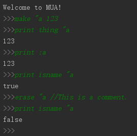
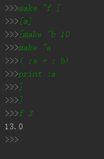
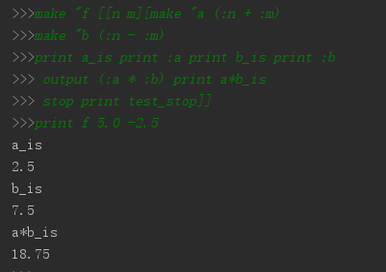
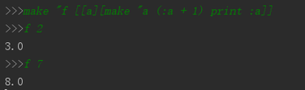
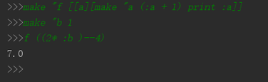
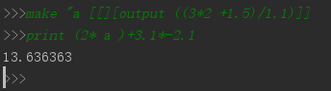
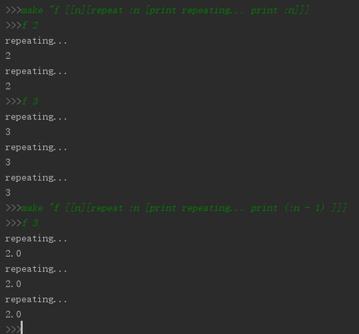
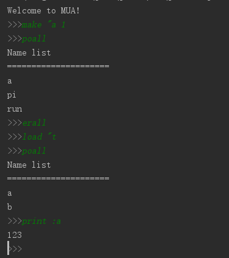

# MakeUp Programming Language
This is an interpreter for a interpreted language written in JAVA. The interpreted language is called MUA(MakeUp Programming Language). The grammar of this language can be found below.

It support function defining, function calling, loop, recursive procedures, etc.

Try it by yourself!
Also, Please **do not** borrow the code directly for course projects if your mentor does not allow you to do so. Thanks: )

## Examples

1.Some basic operations

2.Define a function named `f` with argument `a`. Multi-line definition is support, which means you can
define a function in multiple lines and the interpreter will try to match the brankets.

3.A more complex function. The **infix expression** is also supported. 

4.Argument for functions can be result of an infix expression. Negative numbers supported also.

5.Double numbers and infix expression.

6.Repeat

7.Some other operations.

## Grammar

#### fundamental data type - value

number, word, list, bool

* content of a number starts with`[0~9]` or `-` 
* content of a word starts with`"`. Anything following `"` before a space will be considered as
part of the word, including `"` and `[]`

* content of a list is wrapped with`[]`, the elements inside are seperated by space.
 The elements inside can be any data type and can be different.

### fundamental operation

format: `op_name` `arguments`

Different arguments are seperated by spaces.

fundamental op：

* `//`：comment
* `make <word> <value>`： bind the `value` to the `word`. The `word` is then called `name` and located in the `namespace`.

* `thing <word>`：return the value bound with `word`

* `:<word>`：the same as `thing`

* `erase <word>`：erase the value bound with `word`

* `isname <word>`：if `word` is a `name`

* `print <value>`：print value

* `read`：return a word or list read from stdin

* `readlinst`：return a line read from stdin and form a list

* operator
	
	* `add`, `sub`, `mul`, `div`, `mod`：`<operator> <number> <number>`
	
	* `eq`, `gt`, `lt`：`<operator> <number|word> <number|word>`
	* `and`, `or`：`<operator> <bool> <bool>`
	* `not`：`not <bool>`

* `random <number>`：return a random number between [0,number>

* `sqrt <number>`：return sqrt

* `isnumber <value>`：return bool indicating whether `value` is a number

* `isword <value>`：return bool indicating whether `value` is a word

* `islist <value>`：return bool indicating whether `value` is a list 

* `isbool <value>`：return bool indicating whether `value` is a bool 

* `isempty <word|list>`: return bool indicating whether `word|list` is empty

* `test <value>`：test whether `value` is true or false, no return value

* `iftrue <list>`：if the `test` before is true, do the list

* `iffalse <list>`：if the `test` before is false, do the list

* `word <word> <word|number|bool>`：merge two `word` into one. The second value can be 
`word`,`number`, or `bool`

* `list <list1> <list2>`：merge `list1` and `list2` in to one list, elements in `list2` following 
those in `list1`
* `join <list> <value>`：add the [value] into the [list] as the last element

* `first <word|list>`：return the first character/element of word/list

* `last <word|list>`：return the last character/element of word/list

* `butfirst <word|list>`：return a list/word excepting the last element/character

* `butlast <word|list>`：return a list/word excepting the last element/character

* `item <number> <word|list>`：return the [number] character/element in a word/list

* `repeat <number> <list>`：run the code in [list] for [number] times

* `stop`：stop the execution of current code fragment(may be a piece of code in run/repeat/if/function)

* `wait <number>`：wait for `number` ms

* `save <word>`：save the current namespace to [word]file

* `load <word>`：load contents from [word]file and add to the namespace

* `erall`：erase all the `name`s in current namespace

* `poall`：print all the `name`s in current namespace

### Function

#### definition

		make <word> [<list1> <list2>]
			
word is the function name 
			
list1 is the arguments list, list2 is the operation list

#### call function

		<functionName> <arglist>
functionName is the function name defined in `make`. `"`is not needed.

arglist is the arguments list, values in `arglist` are correspondingly bound to the name 
in function definition.

#### related operations
			

* `output <value>`：set `value` as the return value to the caller. But do not stop execution of function.
* `stop`：stop execution

* `local <word>`： set the `word` as local name. The arguments are also local names.

### Built-in name

The language provide some frequent use constants and operations as built-in name. These names can be erased also.

* `pi`：3.14159

* `if <bool> <list1> <list2>`：if `bool` is true, run `list1`, else `list2`. Both lists can be empty

* `run <list>`：run the code in the `list`

